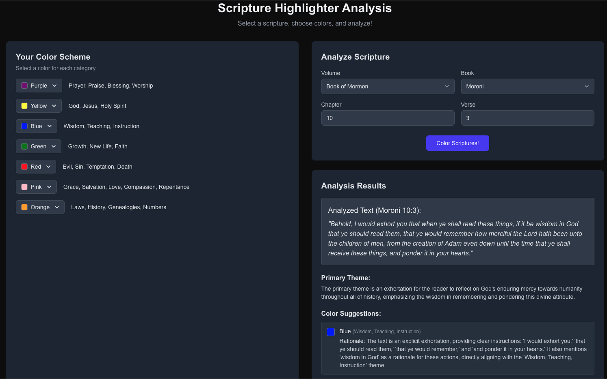

# Colorful Scriptures 🎨📖

An AI-powered scripture study tool designed specifically for **LDS (Latter-Day Saints) scriptures** that provides intelligent color-coding suggestions based on theological themes and concepts.



## Overview

Colorful Scriptures helps LDS members enhance their scripture study by analyzing verses from the standard works and suggesting meaningful colors for highlighting based on theological themes. Using Google's Gemini AI, it identifies concepts like prayer, salvation, wisdom, and growth, then recommends appropriate colors for visual scripture marking.

**Current Status:** Stable and production-ready with comprehensive code quality standards and recent bug fixes for improved user experience.

## Features

### 🎯 **Intelligent Scripture Analysis**

- AI-powered analysis using Google Gemini 2.5 Flash
- Identifies theological themes and concepts in scripture text
- Provides detailed justifications for color suggestions

### 📚 **Complete LDS Scripture Database**

- **Old Testament** (39 books)
- **New Testament** (27 books)
- **Book of Mormon** (15 books)
- **Doctrine and Covenants**
- **Pearl of Great Price** (5 books)

### 🎨 **Customizable Color Scheme**

- 12 predefined colors with theological meanings
- Default scheme includes:
  - **Purple**: Prayer, Praise, Blessing, Worship
  - **Yellow**: God, Jesus, Holy Spirit
  - **Blue**: Wisdom, Teaching, Instruction
  - **Green**: Growth, New Life, Faith
  - **Red**: Evil, Sin, Temptation, Death
  - **Pink**: Grace, Salvation, Love, Compassion, Repentance
  - **Orange**: Laws, History, Genealogies, Numbers

### 💻 **Modern Web Interface**

- Responsive design for desktop and mobile
- Dark mode support with persistent settings
- Intuitive dropdowns for scripture selection
- Real-time analysis results with accurate reference tracking
- Improved analysis display - results maintain correct scripture references

## Tech Stack

- **Frontend**: Next.js 15.3.1, React 19, TypeScript
- **Styling**: TailwindCSS v4 with dark mode
- **Database**: Supabase (PostgreSQL)
- **AI**: Google Generative AI (Gemini 2.5 Flash)
- **Code Quality**: ESLint 9, Prettier 3.6, Husky pre-commit hooks
- **Development**: Turbopack for fast development builds
- **Deployment**: Vercel-ready

## Prerequisites

- Node.js 18+ and npm
- [Google AI API key](https://aistudio.google.com/app/apikey) (free tier available)
- [Supabase account](https://supabase.com) (free tier available)

## Quick Start

### 1. Clone and Install

```bash
git clone https://github.com/voodoogumbo/colorfulscriptures.git
cd colorfulscriptures
npm install
```

### 2. Set up Environment Variables

```bash
cp .env.local.example .env.local
```

Edit `.env.local` with your credentials:

```env
NEXT_PUBLIC_SUPABASE_URL=your_supabase_project_url
SUPABASE_ANON_KEY=your_supabase_anon_key
SUPABASE_SERVICE_ROLE_KEY=your_supabase_service_role_key
GOOGLE_API_KEY=your_google_ai_api_key
```

### 3. Set up Supabase Database

1. Create a new Supabase project
2. Run the database schema:

```sql
-- See docs/database-schema.sql for complete setup
```

### 4. Import Scripture Data

```bash
npm run import-scriptures
```

### 5. Run Development Server

```bash
npm run dev
```

Open [http://localhost:3000](http://localhost:3000) to start analyzing scriptures!

## Detailed Setup Guide

### Getting API Keys

#### Google AI API Key

1. Visit [Google AI Studio](https://aistudio.google.com/app/apikey)
2. Create a new API key
3. Copy the key to your `.env.local` file

#### Supabase Setup

1. Create account at [supabase.com](https://supabase.com)
2. Create new project
3. Go to Settings → API to find your keys and URL
4. Copy Project URL and both keys to `.env.local`

### Database Schema

The application requires a `scriptures` table with the following structure:

```sql
CREATE TABLE scriptures (
  id BIGSERIAL PRIMARY KEY,
  volume_title TEXT NOT NULL,
  book_title TEXT NOT NULL,
  book_short_title TEXT,
  chapter_number INTEGER NOT NULL,
  verse_number INTEGER NOT NULL,
  verse_title TEXT,
  verse_short_title TEXT,
  scripture_text TEXT NOT NULL,
  reference TEXT NOT NULL,
  created_at TIMESTAMP WITH TIME ZONE DEFAULT NOW()
);

-- Add indexes for performance
CREATE INDEX idx_scriptures_reference ON scriptures(book_title, chapter_number, verse_number);
CREATE INDEX idx_scriptures_volume ON scriptures(volume_title);
```

### Scripture Data Import

The included scripture data (`data/lds-scriptures.json`) contains the complete LDS standard works. To import:

```bash
npm run import-scriptures
```

This will populate your Supabase database with approximately 41,000 verses.

## Usage

1. **Configure Your Color Scheme** - Adjust the color meanings to match your study focus
2. **Select Scripture Reference** - Choose volume, book, chapter, and verse
3. **Analyze** - Click "Color Scriptures!" to get AI analysis
4. **Review Results** - See color suggestions with theological justifications

### Recent Improvements

**Enhanced User Experience:**

- **Fixed Analysis Display Bug** - Analysis results now correctly maintain their original scripture reference (book, chapter, verse) regardless of subsequent form changes
- **Improved Reference Accuracy** - Previous analysis results display the correct scripture reference even when you select different verses afterward
- **Persistent Dark Mode** - Your theme preference is now saved and restored between sessions

**Development Quality:**

- **Code Quality Standards** - Comprehensive ESLint and Prettier configuration ensures consistent, maintainable code
- **Automated Quality Checks** - Pre-commit hooks automatically format code and catch potential issues
- **Enhanced Reliability** - All technical debt resolved with improved error handling and user experience

## Development

### Available Scripts

- `npm run dev` - Start development server with Turbopack
- `npm run build` - Build for production
- `npm run start` - Start production server
- `npm run lint` - Run ESLint for code quality checks
- `npm run lint:fix` - Run ESLint and automatically fix issues
- `npm run format` - Format code with Prettier
- `npm run format:check` - Check code formatting without changes
- `npm run import-scriptures` - Import scripture data to database

### Code Quality Standards

This project maintains high code quality standards with:

- **ESLint 9** with TypeScript and Next.js configuration
- **Prettier 3.6** for consistent code formatting
- **Husky pre-commit hooks** with lint-staged for automatic code quality checks
- **Automated formatting** and linting on every commit
- **Type-safe development** with TypeScript strict mode

### Project Structure

```
src/
├── app/
│   ├── page.tsx              # Main scripture analysis interface
│   ├── layout.tsx            # App layout and metadata
│   ├── globals.css           # Global styles and theme
│   └── api/
│       └── analyze-scripture/
│           └── route.ts      # API endpoint for AI analysis
└── lib/
    └── scripture_metadata.json # Scripture book/volume mapping
```

## Contributing

1. Fork the repository
2. Create a feature branch (`git checkout -b feature/amazing-feature`)
3. Commit your changes (`git commit -m 'Add amazing feature'`)
4. Push to the branch (`git push origin feature/amazing-feature`)
5. Open a Pull Request

## License

This project is open source and available under the [MIT License](LICENSE).

## Acknowledgments

- **Scripture Text**: LDS standard works are used under public domain
- **AI Analysis**: Powered by Google's Gemini AI
- **Database**: Hosted on Supabase
- **Framework**: Built with Next.js and React

## Support

For questions or issues, please [open an issue](https://github.com/voodoogumbo/colorfulscriptures/issues) on GitHub.

---

_Built with ❤️ for LDS scripture study and spiritual growth_
